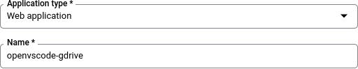
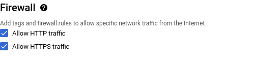

# OpenVSCode GDrive

## What is this?

This is a Web-based version of Microsoft's open source [VS Code](https://code.visualstudio.com) text
editor backed by Google Drive.  It is a server that runs on a remote GNU/Linux machine and affords
clients access to the editor, a terminal, and optionally a graphical desktop.  Specifically, it is
Gitpod's [OpenVSCode Server](https://github.com/gitpod-io/openvscode-server) distribution configured
to use Google accounts for authentication and Google Drive (via [Rclone](https://rclone.org)) for
storage.

To support running graphical applications, it can optionally provide a virtual desktop using
[TigerVNC](https://tigervnc.org) and a hosted copy of the Web-based [noVNC](https://novnc.com)
client.

## What are its limitations?

This project uses Linux namespaces for containerization, and as such only supports recent versions
of that kernel.  Practically, it requires a multicore server or virtual machine because it creates
an independent container running a separate instance of Node, Rclone, TigerVNC, and noVNC's proxy
server for each authenticated user.  Running it as a microservice is infeasible.

As in OpenVSCode Server, some preferences and extensions are stored in the client's browser, and
others are stored on the filesystem.  The former class mean that a user's experience can change as
they move from seat to seat, and the latter pose performance problems for certain addons.  In
particular, language extensions and run/debug support are unlikely to work when installed by users,
so out of the box most compilation and execution should be performed on the command line.  If
language extensions are needed, it may be possible to support them by copying their files into the
container's VSCode installation directory rather than running them out of each user's home.

Isolation is accomplished using containers and processes, and is at most as secure as the hosting
Linux kernel.  This project is designed to be run on a headless server; running it on a desktop may
expose the rest of the system, via the X Window System, to attacks including privilege escalation
and write access to other users' Google Drive files.

## How do I set it up?

You need two things: a Google domain with a registered OAuth application permitting authentication
and access to Google Drive, and a server or virtual machine to run this project on.

### Registering a per-domain OAuth application

This section assumes (1) that your school or organization uses Google Workspace, (2) that you have
an account in the same domain as your students or users, and (3) that your account has access to the
Google Cloud console.  Unless you request Google's approval, only users from the single domain in
question will be able to log in; therefore, if (1) is not true, you might consider registering your
own domain for [Google Cloud Identity
Free](https://cloud.google.com/identity/docs/set-up-cloud-identity-admin) and creating domain
accounts for your users.  If (2) or (3) is not true, you will need to ask your IT department for
assistance.

1. Go to [console.cloud.google.com](https://console.cloud.google.com), sign in with your domain
   account, and accept the terms of service if applicable.

1. In the upper-left corner of the page, click **Select a project**:

   

1. In the upper-right corner of the resulting dialog, click **new project**:

   

1. Give your project a(n internal) name and hit **create**:

   

1. Once the Notifications panel shows a green check mark, click **select project**:

   

1. If no sidebar is open on the left side of the page, click the hamburger button in the upper left:

   

1. In the sidebar on the left, hover over **APIs & Services** and select **Enabled APIs & services**:

   

1. At the top of the page, click **enable APIs and services**:

   

1. Scroll down to find Google Workspace and click **Google Drive API**:

   

1. Click the blue **enable** button and wait for the spinner to go away and the page to reload:

   

1. On the left side of the page, click **OAuth consent screen**:

   

1. Set User Type to **Internal** and click **create**:

   

1. Give your project a (user-facing) name, provide the required contact email addresses, and hit
   **save and continue**:

   

1. Click the **add or remove scopes** button:

   

1. Under Manually add scopes, enter `https://www.googleapis.com/auth/drive`, click **add to table**,
   then click **update**:

   

1. Click **save and continue**:

   

1. On the left side of the page, click **Credentials**:

   

1. At the top of the page, click **create credentials** and choose **OAuth client ID**:

   

1. Set Application type to **Web application** and give it a(n internal) name:

   

1. Under Authorized redirect URIs, click **add URI**:

   

1. Enter the domain name at which you will host your server and hit **create**:

   

1. Click the **download JSON** button in the resulting dialog, and save the file for later:

   

### Optional: Creating a Google Cloud virtual machine

This section illustrates how to set up a hosted VM on Google Cloud, which is free in the short term
under the service's trial.  There is no technical reason this project has to be hosted on Google
infrastructure.  Skip this section if you already have a server or VM available.

1. From the Google Cloud console at [console.cloud.google.com](https://console.cloud.google.com),
   click the **activate** button in the upper-right corner of the page and follow the resulting
   steps to start your free trial:

   

1. In the upper-left corner of the page, click **Select a project** or the name of the selected
   project:

   

1. In the upper-right corner of the resulting dialog, click **new project**:

   

1. Give your project a(n internal) name and hit **create**:

   

1. Once the Notifications panel shows a green check mark, click **select project**:

   

1. If no sidebar is open on the left side of the page, click the hamburger button in the upper left:

   

1. In the sidebar on the left, hover over **VPC network** and select **IP addresses**:

   

1. Click the **reserve external static address** button:

   

1. Give the IP address a name, set its Network Service Tier to **Standard**, and hit **reserve**:

   

1. Take note of the IP address on the resulting page, as you will need it later:

   

1. If you do not want your instance to support GUI applications, skip this step.  Otherwise, in the
   sidebar on the left, hover over **VPC network** and select **Firewall**.  Click the **create
   firewall rule** button at the top.  Name the rule `allow-novnc`, leave Direction of traffic set
   to Ingress and Action on match set to Allow, and set Targets to **All instances in the network**
   and Source IPv4 ranges to `0.0.0.0/0`.  Check the **TCP** box and enter `6081-7999`.  Finally,
   hit the **create** button.

   

1. In the sidebar on the left, hover over **Compute Engine** and select **VM instances** under
   virtual machines:

   

1. Click the blue **enable** button and wait for the spinner to go away and the page to reload:

   

1. At the top of the page, click **create instance**:

   

1. Select a name and region, and leave the default Debian boot disk image selected:

   

1. Under Firewall, check **Allow HTTPS traffic**:

   

1. Expand **networking, disks, security, management, sole-tenancy**, expand **Networking**, then
   expand **default** under Network interfaces:

   

1. Set **External IPv4 address** to the one you created above and hit **done**:

   

1. At the bottom of the page, hit the **create** button:

   

1. On the resulting page, wait for the Status spinner to turn into a green check mark, then click
   the SSH button:

   
